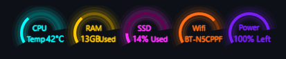

# Neon-Synthwave-Gauges

<!--
*** Thanks for checking out the Best-README-Template. If you have a suggestion
*** that would make this better, please fork the repo and create a pull request
*** or simply open an issue with the tag "enhancement".
*** Don't forget to give the project a star!
*** Thanks again! Now go create something AMAZING! :D
-->

 

  
  

  Clean system monitors for rainmeters where vertical space is a premium.
   
   
  <a href="https://github.com/grjsmith/Neon-Synthwave-Gauges"><strong>Explore the docs »</strong></a>
   
  <a href="https://github.com/grjsmith/Neon-Synthwave-Gauges/issues">Report Bug</a>
  ·
  <a href="https://github.com/grjsmith/Neon-Synthwave-Gauges/issues">Request Feature</a>
  

<!-- TABLE OF CONTENTS -->

  
Table of Contents

  <ol>
    <li><a href="#about-the-project">About The Project</a>
      <ul>
        <li><a href="#built-with">Built With</a></li>
      </ul>
    </li>
    <li><a href="#getting-started">Getting Started</a>
      <ul>
        <li><a href="#prerequisites">Prerequisites</a></li>
        <li><a href="#installation">Installation</a></li>
      </ul>
    </li>
    <li><a href="#usage">Usage</a></li>
    <li><a href="#roadmap">Roadmap</a></li>
    <li><a href="#contributing">Contributing</a></li>
    <li><a href="#license">License</a></li>
    <li><a href="#contact">Contact</a></li>
    <li><a href="#acknowledgments">Acknowledgments</a></li>
  </ol>

## About The Project
I love the whole Synthwave aesthetic! I like the music, artists like [Dreamkid](https://open.spotify.com/artist/0603X4AUnZec4wiHJNsynF), [Daniel Delux](https://open.spotify.com/artist/0OTY72l7CC7ynKzp6N2o5b) and [Code Elektro](https://open.spotify.com/artist/3FIZFOkx25ESPENGx6st5w). I love [Robb Owen's SynthWave '84 VSCode](https://marketplace.visualstudio.com/items?itemName=RobbOwen.synthwave-vscode). I made a [synthwave](https://github.com/grjsmith/Neon-Synthwave) [Obsidian](https://obsidian.md/) theme. It was about time I created a Rainmeter theme. Times have changed since I created the [Clean Text and Graphs theme](https://github.com/grjsmith/clean-text-and-graphs-for-rainmeter) that was designed to sit at the top of the screen. Now I wanted something that could site on the right or left side of the screen or, in my case, on the right side of my second monitor.

(<a href="#top">back to top</a>)

### Built With

* [Rainmeter](https://www.rainmeter.net/)

(<a href="#top">back to top</a>)

## Getting Started
### Prerequisites

* Download Rainmeter from [https://www.rainmeter.net/](https://www.rainmeter.net/)
* Download the skins from [my S3 bucket](https://entropybit.s3.eu-west-1.amazonaws.com/Neon+Synthwave+Gauges_0.2.rmskin)

### Installation
* Install Rainmeter, [following the excellent documentation if you need it](https://docs.rainmeter.net/manual/installing-rainmeter/)
* Navigate to the place you saved ``Neon Synthwave Gauges_0.1.rmskin`` and doubleclick on it. That will open the Rainmeter skins window and all you to open the skins you want to use.

## Roadmap

* I'd like to see if I can find out how to add more useful information to some of the tooltips

See the [open issues](https://github.com/grjsmith/Neon-Synthwave-Gauges/issues) for a full list of proposed features (and known issues).

(<a href="#top">back to top</a>)

## Contributing
Contributions are what make the open source community such an amazing place to learn, inspire, and create. Any contributions you make are **greatly appreciated**.

If you have a suggestion that would make this better, please fork the repo and create a pull request. You can also simply open an issue with the tag "enhancement".
Don't forget to give the project a star! Thanks again!

1. Fork the Project
2. Create your Feature Branch (`git checkout -b feature/AmazingFeature`)
3. Commit your Changes (`git commit -m 'Add some AmazingFeature'`)
4. Push to the Branch (`git push origin feature/AmazingFeature`)
5. Open a Pull Request

(<a href="#top">back to top</a>)

## License
The person who associated a work with this deed has dedicated the work to the public domain by waiving all of his or her rights to the work worldwide under copyright law, including all related and neighboring rights, to the extent allowed by law.
You can copy, modify, distribute and perform the work, even for commercial purposes, all without asking permission. See Other Information below.
 

(<a href="#top">back to top</a>)

## Contact

* Grant Smith - [@grjsmith](https://twitter.com/grjsmith) - grant@nextgendevops.com
* Project Link: [https://github.com/grjsmith/Neon-Synthwave-Gauges](https://github.com/grjsmith/Neon-Synthwave-Gauges)

(<a href="#top">back to top</a>)

<!-- ACKNOWLEDGMENTS -->
## Acknowledgments
* Thanks to the Rainmeter team for the awesome tutorials

(<a href="#top">back to top</a>)
